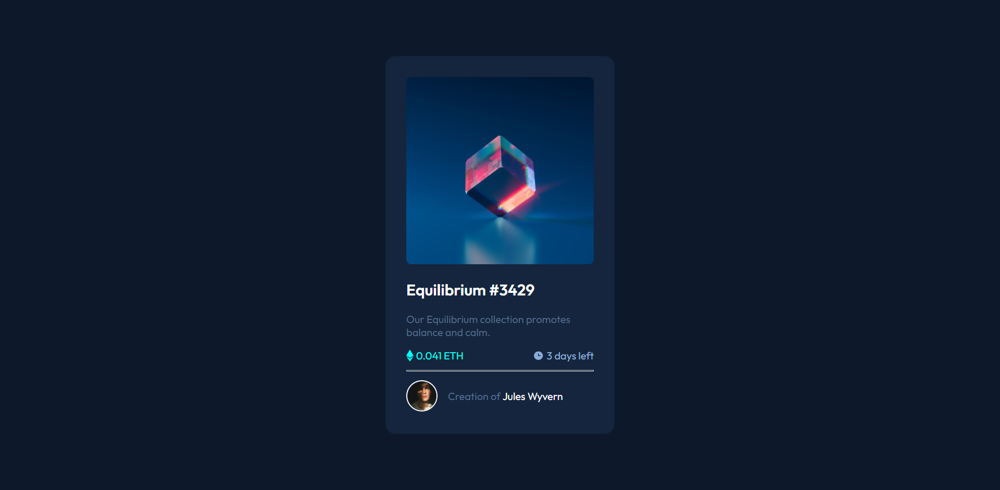
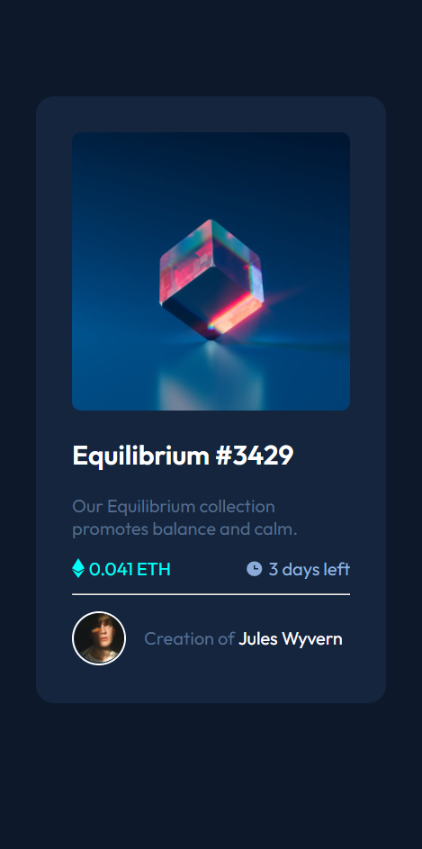

# Frontend Mentor - NFT preview card component solution <!-- omit in toc -->

This is a solution to the [NFT preview card component challenge on Frontend Mentor](https://www.frontendmentor.io/challenges/nft-preview-card-component-SbdUL_w0U). Frontend Mentor challenges help you improve your coding skills by building realistic projects.

## Table of contents <!-- omit in toc -->

1. [Overview](#overview)
   1. [The challenge](#the-challenge)
   2. [Screenshot](#screenshot)
      1. [**Given Design**](#given-design)
      2. [**Output**](#output)
   3. [Links](#links)
2. [My process](#my-process)
   1. [Built with](#built-with)
   2. [What I learned](#what-i-learned)
3. [Author](#author)
4. [Acknowledgments](#acknowledgments)

## Overview

### The challenge

Users should be able to:

-   View the optimal layout depending on their device's screen size
-   See hover states for interactive elements

### Screenshot

#### **Given Design**


#### **Output**




### Links

-   Solution URL: [GitHub](https://github.com/SumitK27/frontend-mentor/)
-   Live Site URL: [Test My Code](https://testmycode.ga/frontend-mentor/nft-preview-card-component/)

## My process

### Built with

-   Semantic HTML5 markup
-   CSS Units
-   Custom Font
-   Flexbox

### What I learned

-   Centering a container using flex box.
-   Modifying `hr`.
-   Adjusting width and height of an element with `box-sizing` to avoid padding and border overflow.

```css
*,
*::before,
*::after {
    box-sizing: border-box;
}
```

## Author

-   Website - [Test My Code](https://testmycode.ga/frontend-mentor/nft-preview-card-component/)
-   Frontend Mentor - [@SumitK27](https://www.frontendmentor.io/profile/SumitK27)
-   Twitter - [@SumitKajbaje](https://www.twitter.com/SumitKajbaje)

## Acknowledgments

Thanks to [Anton](https://stackoverflow.com/a/6382036) for his solution on adding color to hr.
